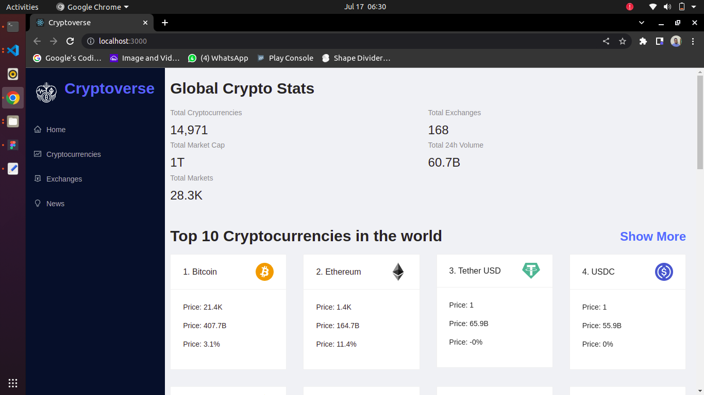
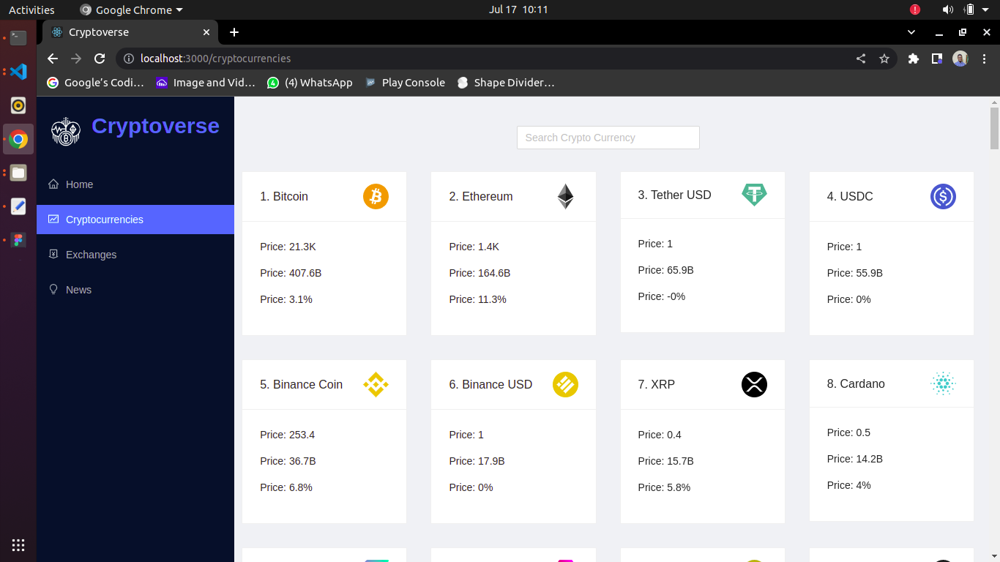
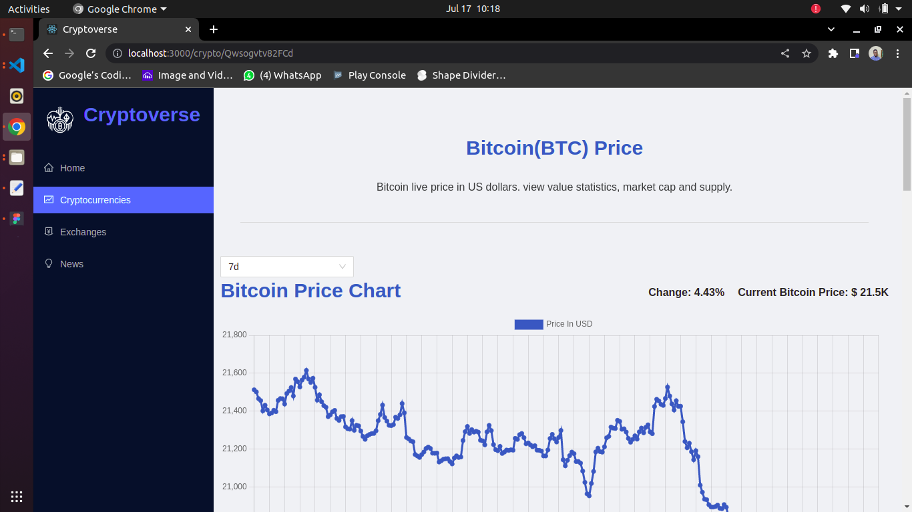
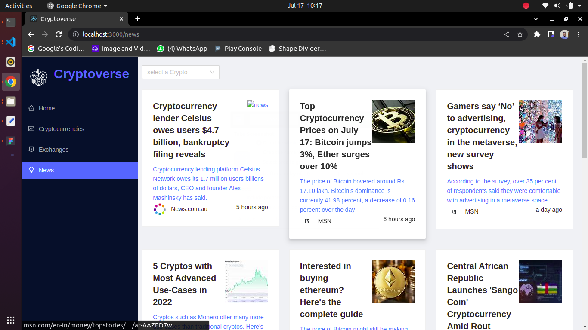

# Cryptoverse

This is a react project for viewing and tracking crypto markets as well as the news associated with all cryptocurrencies.

# Preview

## Technologies and libraries used
- React
- Css
- ant design
- redux toolkit
- axios
- chart.js
- html-react-parser
- millify
- moment
- react
- react-chartjs-2
- react-redux
- react-router-dom

## Screenshots
#### Home page

#### Currencies page

#### Single Currency Page

#### Crypto News

